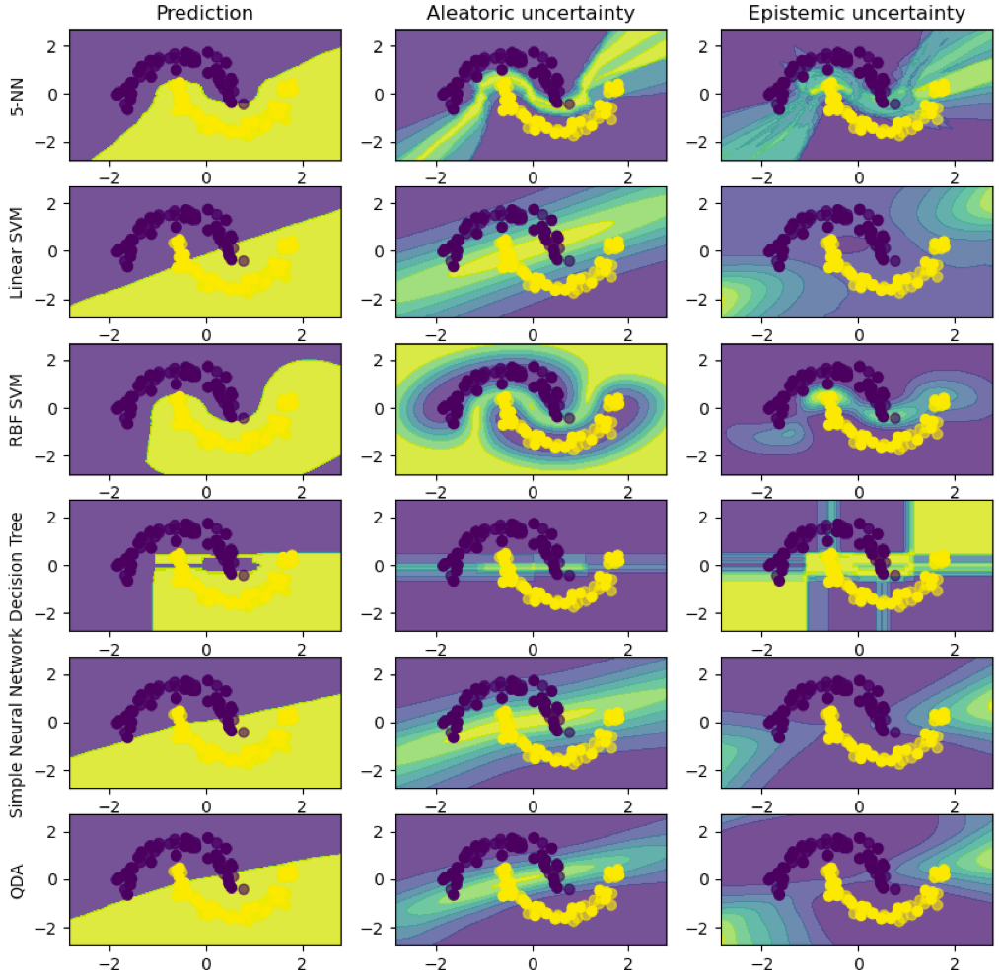

# Uncertainty-Aware Machine Learning 

Python package for uncertainty-aware classification built on top of Scikit-learn. 

## Description

**uaml** is a Python package for uncertainty-aware machine learning based on probabilistic ensembles and the Jensen–Shannon divergence. Currently, it is built on top of scikit-learn and supports all probabilistic base classifiers. 

## Installation

Clone this repository [`tfmortie/uaml`](https://github.com/tfmortie/uaml.git) and run `pip install . -r requirements.txt`
or install by means of `pip install uaml`.

## Examples

```python
import numpy as np

from sklearn.svm import SVC
from uaml.classifier import UAClassifier

# Some example data
X_train, X_test, y_train = np.random.randn(1000,100), np.random.randn(100,100), np.random.randint(0,5,1000)

# Use SVC as base (probabilistic) estimator
estm = SVC(gamma=2, C=1, probability=True) 

# Constuct and fit an uncertainty-aware classifier with 500 estimators and parallelize over 5 cores 
clf = UAClassifier(estm, mc_sample_size=0.5, n_mc_samples=500, n_jobs=5)
clf.fit(X_train, y_train)

# Obtain predictions by means of majority voting and calculate aleatoric and epistemic uncertainty
yhat = clf.predict(X_test, avg=True)
ua, ue = clf.get_uncertainty(X_test)
```



## References

* _Aleatoric and epistemic uncertainty in machine learning: an introduction to concepts and methods, H\"ullermeier et al., Machine learning (2021)_
